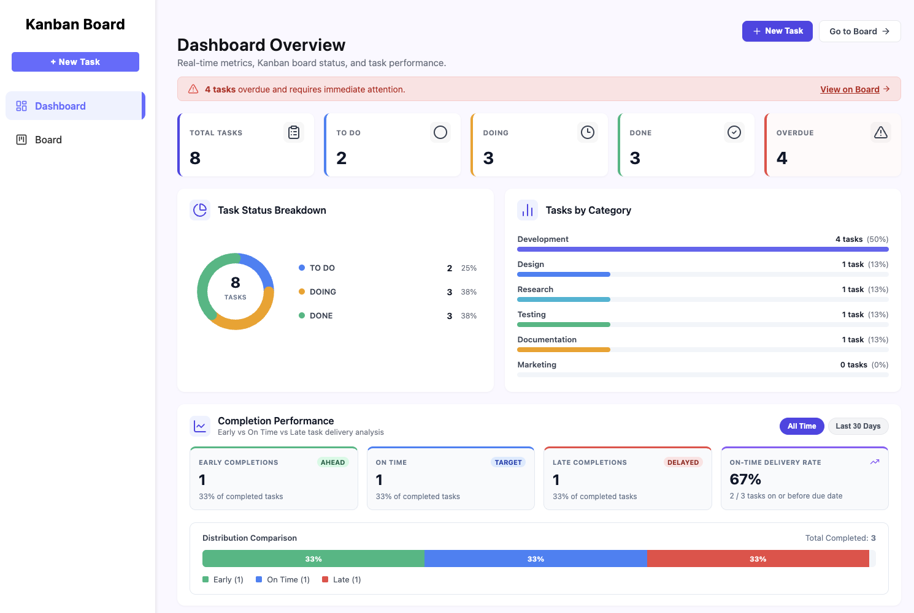
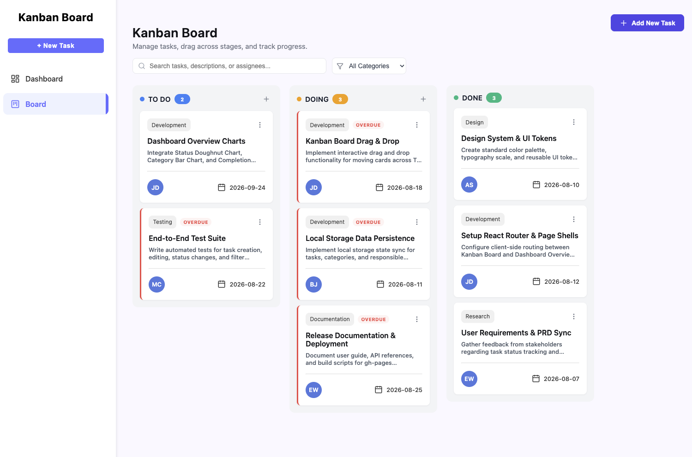
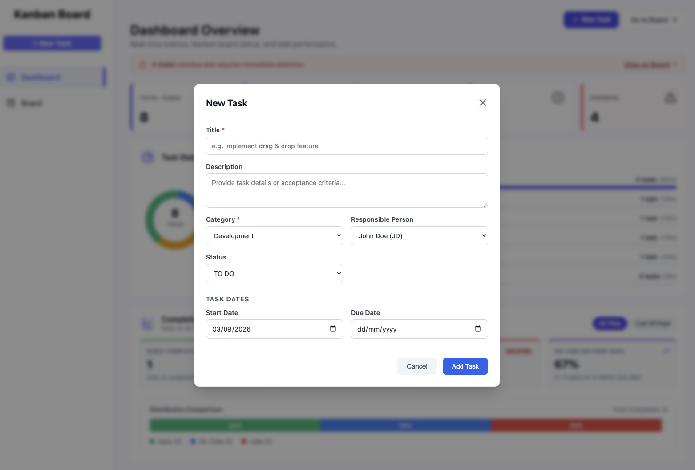
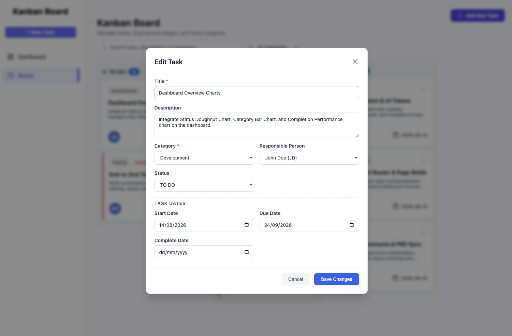

# Kanban Board & Analytics Dashboard

A modern, responsive React-based task management web application featuring an interactive Kanban board and a real-time analytics dashboard. Built with React 19, Vite, and React Router.

---

## 📋 Project Description

The **Kanban Board & Analytics Dashboard** provides an intuitive workflow for managing project tasks, tracking deadlines, and visualizing productivity metrics.

### Key Features

- **Interactive Kanban Board**: Organize tasks across three workflow stages—`TO DO`, `DOING`, and `DONE`—with drag-and-drop capability.
- **Task Lifecycle Management**: Create, edit, and delete tasks with attributes including title, description, category, assignee (responsible person), start date, due date, and completion date.
- **Real-Time Analytics Dashboard**:
  - **Summary Metrics**: High-level counters for total tasks, status breakdowns, and overdue alerts.
  - **Status Breakdown**: Visual doughnut chart depicting the distribution of tasks across stages.
  - **Workload by Category**: Horizontal bar chart showing task distribution across project domains (e.g., Development, Design, Research, Testing, Documentation).
  - **Completion Performance**: Delivery analysis tracking Early, On-Time, and Late task completions with an overall on-time delivery rate.
- **Search & Filtering**: Instant search by task title, description, or assignee, coupled with dynamic category filtering.
- **Overdue Detection**: Automatic highlighting of overdue tasks with warning badges and notification banners.
- **Local Persistence**: State automatically synchronizes with browser `localStorage`, ensuring data persists between sessions.

---

## 📸 Screenshots

### 1. Dashboard Overview

Comprehensive visual analytics tracking task counts, status breakdown, category distribution, overdue alerts, and delivery performance.


### 2. Kanban Board

Interactive multi-column board with drag-and-drop cards, priority tags, overdue indicators, quick search, and category filter.


### 3. Create Task Modal

Modal form for adding new tasks with category selection, assignee assignment, and scheduling dates.


### 4. Edit Task Modal

Detailed editor allowing updates to task details, workflow status, and completion date logging.


---

## 👥 Team Members

- Sai Pone Kha Aung, 6611708
- Nang Mwe Kham, 6540037

---

## 🚀 Basic Usage Instructions

### Prerequisites

- [Node.js](https://nodejs.org/) (version 18+ recommended)
- [npm](https://www.npmjs.com/) (bundled with Node.js)

### Installation

1. Clone or download the repository:

   ```bash
   git clone https://github.com/Sai-Pone-Kha-Aung/kanban_board.git
   cd kanban_board
   ```

2. Install dependencies:
   ```bash
   npm install
   ```

### Running Locally

Start the Vite development server:

```bash
npm run dev
```

Open your browser and navigate to the local server URL displayed in the terminal (typically `http://localhost:5173`).

### Building for Production

To create an optimized production build:

```bash
npm run build
```

Preview the production build locally:

```bash
npm run preview
```

---

## 💡 How to Use the Application

1. **Navigate the Application**:
   - Use the left sidebar to switch between the **Dashboard** and the **Board**.
2. **Create a Task**:
   - Click the **+ New Task** / **+ Add New Task** button in the sidebar, header, or board column.
   - Fill in the title, description, category, responsible person, and start/due dates, then click **Add Task**.
3. **Move Tasks**:
   - Drag and drop task cards between **TO DO**, **DOING**, and **DONE** columns.
   - Alternatively, click the card menu (⋮) to edit status directly.
4. **Edit or Delete a Task**:
   - Click the menu icon (⋮) on any task card and select **Edit** or **Delete**.
   - Set the **Complete Date** when marking a task as done to update delivery performance metrics.
5. **Search and Filter**:
   - Type keywords into the search box on the Kanban board to filter by title, description, or assignee name.
   - Use the category dropdown to view tasks in specific categories.
6. **Review Metrics**:
   - Visit the **Dashboard** to monitor task throughput, review overdue items, and evaluate on-time delivery performance.

---

## 🛠️ Technology Stack

- **Frontend**: React 19, React Router v7
- **Icons**: Lucide React
- **Styling**: Vanilla CSS (CSS Modules & Custom UI Tokens)
- **Build Tool**: Vite 8
- **Storage**: Browser `localStorage` API
